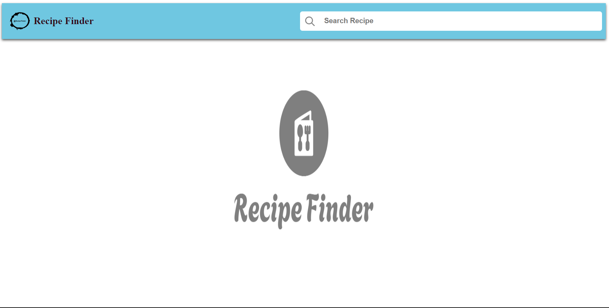
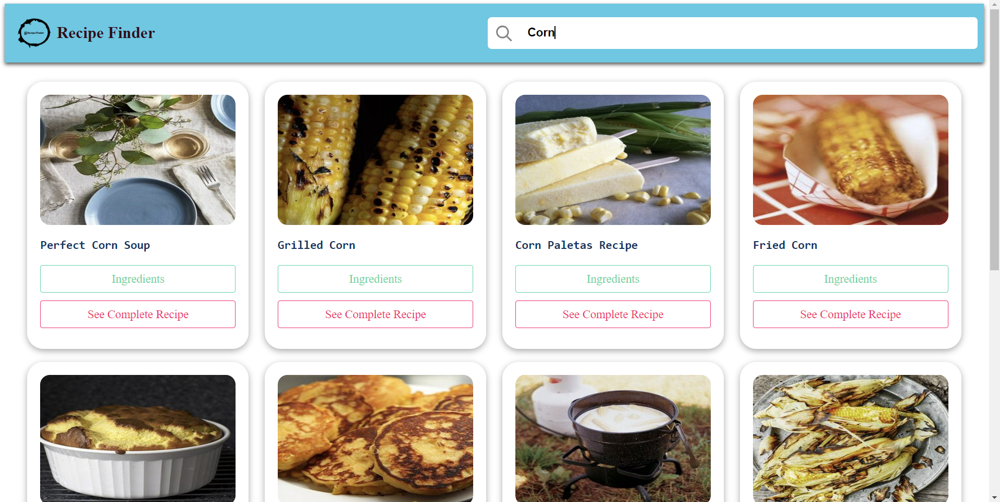
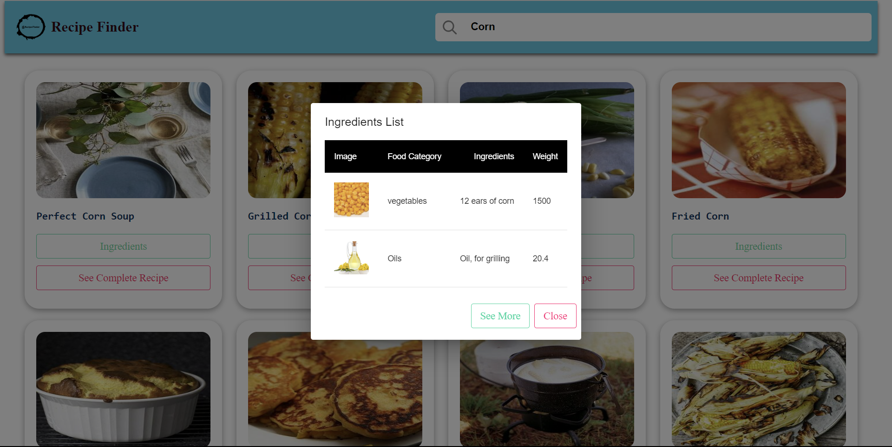

# Sam's Recipe Finder Application - React 🍑 🍜 🍴 🍒 🍕 🍏

## Description

A single page web application that allows users to search recipes based on their query.

## Tech Stacks Used:

- React
- CSS
- JavaScript
- API

## Libraries Used:

- `style-components`
- `axios`
- `react-scripts`
- `material-ui`

## API Used:

Edamam Recipe Search API

Link : https://www.edamam.com/

## How this App Works:

- Search a recipe in the search input
- Grabs the recipe information from Edamam API
- Information is returned has a JSON object
- Using React components to structure data into presentational format
- Using CSS to create visually appealing and user friendly application

## Screenshots

Type your recipe in search bar

Click on the Ingredients list, you will see UI like below:

